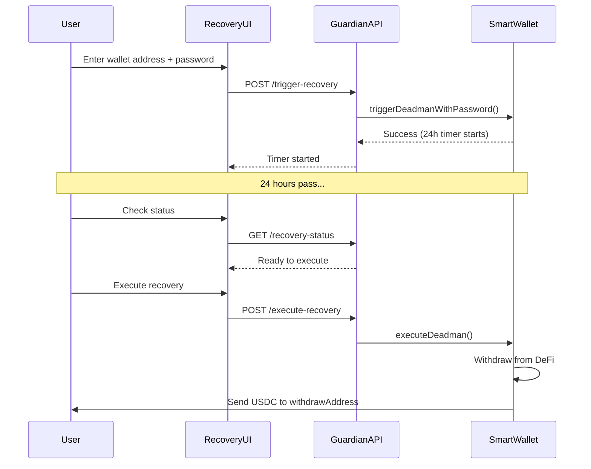

# Progressive Self-Custody Build Plan

## Project Overview

A "DeFi-enabled passkey wallet purpose-built for a single application" that provides:

- Frictionless onboarding via passkeys (no mnemonics, no gas management)
- Counterfactual smart wallet deployment (address exists before deployment)
- Auto-invest idle USDC into DeFi yield
- Facilitator-paid gas (recovered via USDC transfer at end of each bundle)
- Password-based guardian recovery for lost passkeys

---

## Architecture

```mermaid
flowchart TB
    subgraph user [User Layer]
        Passkey[Passkey Device]
        CEX[Centralized Exchange]
        RecoveryPwd[Recovery Password]
    end
    
    subgraph frontend [Frontend]
        MainCTA[Create Account CTA]
        ExistingCTA[Existing Account CTA]
        AdvancedCTA[Advanced Section]
        RecoveryUI[Recovery UI]
        WalletUI[Wallet Interface]
    end
    
    subgraph api [API Layer]
        Facilitate[/api/facilitate]
        Guardian[/api/guardian]
        PrepareCall[/api/prepare-call]
        DeployWallet[/api/deploy-wallet]
    end
    
    subgraph contracts [Smart Contracts]
        Factory[Factory.sol]
        SmartWallet[SmartWallet.sol]
        Example[Example.sol]
        DeFiVault[DeFi Vault Integration]
    end
    
    Passkey --> MainCTA
    Passkey --> ExistingCTA
    RecoveryPwd --> RecoveryUI
    RecoveryUI --> Guardian
    CEX -->|Send USDC| SmartWallet
    MainCTA --> WalletUI
    WalletUI --> PrepareCall
    WalletUI --> Facilitate
    Facilitate --> SmartWallet
    Guardian -->|triggerDeadman| SmartWallet
    DeployWallet --> Factory
    Factory -->|CREATE2| SmartWallet
    SmartWallet -->|PayUSDC| Example
    SmartWallet <-->|Deposit/Withdraw| DeFiVault
    SmartWallet -->|Gas fee USDC| Facilitate
```

---

## Phase 1: Smart Contracts

### 1.1 Copy and Adapt SlopWallet Contracts

Copy contracts from [SlopWalletContracts.md](SlopWalletContracts.md) into `packages/foundry/contracts/`:| Contract | Purpose | Modifications Needed |

|----------|---------|---------------------|

| `SmartWallet.sol` | User's wallet | Add withdraw address, guardian, deadman, recovery password hash, DeFi hooks |

| `Factory.sol` | Deploys wallet clones | Add initial USDC collection for facilitator on deploy |

| `Clones.sol` | EIP-1167 proxies | No changes needed |

### 1.2 SmartWallet.sol Additions

New state variables:

```solidity
address public withdrawAddress;           // CEX/ENS address for recovery
address public guardian;                  // Facilitator by default
bytes32 public recoveryPasswordHash;      // keccak256(password) for guardian recovery
uint256 public lastActivityTimestamp;     // For deadman's switch
uint256 public deadmanDelay;              // Default 24 hours
uint256 public deadmanTriggeredAt;        // When recovery was initiated (0 = not triggered)
```

New functions:

- `setWithdrawAddress(address)` - passkey-signed meta-tx
- `setRecoveryPasswordHash(bytes32)` - passkey-signed, set during onboarding
- `triggerDeadmanWithPassword(string password)` - guardian can call if hash matches
- `cancelDeadman()` - passkey owner cancels
- `executeDeadman()` - guardian executes after delay expires
- `heartbeat()` - update lastActivityTimestamp (called in every meta-tx)
- `investUSDC(uint256)` - deposit into DeFi vault
- `withdrawFromDeFi(uint256)` - pull from vault for transfers

### 1.3 Example.sol (Application Contract)

```solidity
contract Example {
    address public owner;
    IERC20 public usdc;
    
    event PaymentReceived(address indexed from, uint256 amount);
    
    function payUSDC(uint256 amount) external;  // Receives USDC from wallets
    function withdraw(address to) external;      // Owner withdraws collected USDC
}
```


### 1.4 DeFi Integration

For MVP on Base, integrate with Aave V3:

- Deposit USDC → receive aUSDC
- Track balance via aUSDC holdings
- Auto-deposit on receive, auto-withdraw on spend

---

## Phase 2: Facilitator API

### 2.1 Facilitator Service Design

The facilitator:

- Has a private key in `FACILITATOR_PRIVATE_KEY` env var
- Receives signed meta-tx bundles from users
- Submits transactions and pays gas upfront
- Recovers gas cost via USDC transfer at end of each bundle

### 2.2 Gas Recovery Model

Every transaction bundle prepared for users includes a final call:

```javascript
calls = [
  { ...userAction1 },
  { ...userAction2 },
  { target: USDC, data: transfer(facilitatorAddress, gasFeeInUSDC) }  // Gas recovery
]
```

Gas fee calculation (in `/api/prepare-call`):

- Estimate gas for the bundle
- Convert to USDC using on-chain price oracle or fixed rate
- Add small buffer (e.g., 10%)
- Append USDC transfer to facilitator

### 2.3 Facilitator API Endpoint

`POST /api/facilitate`:

```typescript
// Input
{
  smartWalletAddress: string,
  chainId: number,
  isBatch: boolean,
  calls: Array<{ target, value, data }>,  // Includes gas recovery transfer
  qx: string,
  qy: string,
  deadline: string,
  auth: WebAuthnAuth
}

// Server-side
const wallet = new Wallet(process.env.FACILITATOR_PRIVATE_KEY, provider);
// Submit metaExecPasskey or metaBatchExecPasskey
// Return txHash
```


### 2.4 Deployment Gas Recovery

On wallet deployment via `/api/deploy-wallet`:

1. Deploy wallet via Factory (CREATE2)
2. Call `initialize()` with passkey
3. If USDC present, take deployment fee (e.g., 0.50 USDC)
4. Invest remaining USDC into DeFi

---

## Phase 3: Guardian API & Password Recovery

### 3.1 Recovery Password Setup (During Onboarding)

After first deposit, prompt user:

1. "Set a recovery password in case you lose your passkey"
2. User enters password (client-side)
3. Hash password: `keccak256(walletAddress + password)`
4. Sign meta-tx: `setRecoveryPasswordHash(hash)`
5. Facilitator executes

**Important**: Password never leaves the client unhashed. Only hash stored on-chain.

### 3.2 Guardian API Endpoint

`POST /api/guardian/trigger-recovery`:

```typescript
// Input
{
  smartWalletAddress: string,
  password: string  // Plain text - hashed server-side
}

// Server-side
1. Compute hash = keccak256(smartWalletAddress + password)
2. Call wallet.recoveryPasswordHash() to verify
3. If match, call wallet.triggerDeadmanWithPassword(password)
4. Return { success: true, executionTime: now + 24 hours }
```

`GET /api/guardian/recovery-status`:

```typescript
// Input: ?wallet=0x...
// Returns: { triggered: boolean, executionTime: number, withdrawAddress: string }
```

`POST /api/guardian/execute-recovery`:

```typescript
// Input: { smartWalletAddress }
// Checks if delay passed, calls executeDeadman()
// Withdraws from DeFi and sends all to withdrawAddress
```


### 3.3 Recovery Flow




### 3.4 Cancel Recovery

If user still has passkey access:

1. Sign meta-tx calling `cancelDeadman()`
2. Submit via `/api/facilitate`
3. Timer resets, recovery cancelled

---

## Phase 4: Frontend

### 4.1 Landing Page (`/`)

```javascript
[Create Account]  ← Primary CTA (generate passkey)
[Existing Account] ← Secondary CTA (login with passkey)

                    [Advanced] ← Hidden/small link
```


### 4.2 Onboarding Flow

1. **Create Account**: Generate passkey → show counterfactual address
2. **Deposit Prompt**: QR code + address, wait for USDC
3. **First Deposit Detected**: 

- Deploy wallet (facilitator takes fee)
- Prompt for withdraw address
- Prompt for recovery password
- Invest remainder into DeFi

4. **Gamification**: "Withdraw $1 to verify your CEX works" → sets withdraw address

### 4.3 Wallet Page (`/wallet/[address]`)

Sections:

1. **Balance**: USDC in DeFi + yield earned
2. **Actions**: [Pay USDC] to Example contract
3. **Withdraw**: Amount input → withdraw to saved address
4. **Settings**: Change withdraw address, change recovery password

### 4.4 Recovery Page (`/recover`)

For users who lost their passkey:

1. Enter wallet address
2. Enter recovery password
3. Shows withdraw address (masked: 0x1234...abcd)
4. [Trigger Recovery] → starts 24h timer
5. Status page shows countdown
6. After 24h: [Execute Recovery] button

### 4.5 Advanced Page (`/advanced`)

For users with ECDSA wallets:

- Connect via RainbowKit
- Become guardian (transfer guardian role)
- Become owner (full control)
- Manage passkeys (add/remove)
- Self-facilitate transactions

---

## Phase 5: Transaction Bundle Preparation

### 5.1 Prepare Call API

`POST /api/prepare-call`:

```typescript
// Input
{
  wallet: string,
  action: "payUSDC" | "withdraw" | "setWithdrawAddress" | "setRecoveryPassword",
  params: { amount?, to?, address?, passwordHash? },
  qx: string,  // For nonce lookup
  qy: string
}

// Output
{
  calls: [
    { target, value, data },  // Action calls
    { target: USDC, value: 0, data: transfer(facilitator, fee) }  // Gas recovery
  ],
  nonce: string,
  deadline: string,
  challengeHash: string,  // For passkey signing
  estimatedGasFee: string  // In USDC
}
```


### 5.2 Example: Pay USDC Bundle

For a user paying 10 USDC to Example contract:

```javascript
calls = [
  // 1. Withdraw 10.05 USDC from DeFi (10 + gas fee)
  { target: AavePool, data: withdraw(USDC, 10.05e6, wallet) },
  // 2. Approve Example contract
  { target: USDC, data: approve(Example, 10e6) },
  // 3. Pay to Example
  { target: Example, data: payUSDC(10e6) },
  // 4. Gas fee to facilitator
  { target: USDC, data: transfer(facilitator, 0.05e6) }
]
```

---

## File Structure

```javascript
packages/
├── foundry/
│   ├── contracts/
│   │   ├── SmartWallet.sol      # User wallet with recovery
│   │   ├── Factory.sol          # CREATE2 deployment  
│   │   ├── Clones.sol           # EIP-1167 library
│   │   └── Example.sol          # Sample app contract
│   ├── script/
│   │   └── Deploy.s.sol
│   └── test/
│       ├── SmartWallet.t.sol
│       └── Guardian.t.sol       # Test password recovery
├── nextjs/
│   ├── app/
│   │   ├── page.tsx             # Landing
│   │   ├── wallet/[address]/page.tsx
│   │   ├── recover/page.tsx     # Password recovery UI
│   │   └── advanced/page.tsx
│   ├── app/api/
│   │   ├── facilitate/route.ts
│   │   ├── deploy-wallet/route.ts
│   │   ├── prepare-call/route.ts
│   │   └── guardian/
│   │       ├── trigger-recovery/route.ts
│   │       ├── recovery-status/route.ts
│   │       └── execute-recovery/route.ts
│   └── utils/
│       └── passkey.ts
```

---

## Environment Variables

```env
# Facilitator wallet (pays gas, receives USDC recovery)
FACILITATOR_PRIVATE_KEY=0x...
FACILITATOR_ADDRESS=0x...

# Chain config
ALCHEMY_API_KEY=...
TARGET_CHAIN_ID=8453  # Base

# Contract addresses (after deployment)
FACTORY_ADDRESS=0x...
EXAMPLE_ADDRESS=0x...
USDC_ADDRESS=0x833589fCD6eDb6E08f4c7C32D4f71b54bdA02913
AAVE_POOL_ADDRESS=0x...
```

---

## Implementation Order

| Phase | Task | Priority |

|-------|------|----------|

| 1.1 | Copy SlopWallet contracts | P0 |

| 1.2 | Add SmartWallet modifications (guardian, recovery password, deadman) | P0 |

| 1.3 | Create Example.sol | P0 |

| 2.1-2.3 | Facilitator API with gas recovery | P0 |

| 3.1-3.3 | Guardian API with password recovery | P0 |

| 4.1-4.2 | Landing page + onboarding flow | P0 |

| 4.3 | Wallet page | P0 |

| 4.4 | Recovery page | P1 |

| 1.4 | DeFi integration (Aave) | P1 |

| 5.x | Transaction bundle preparation with gas fees | P1 |