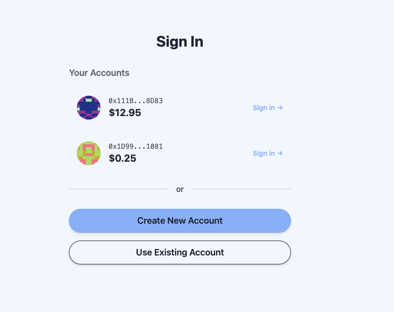
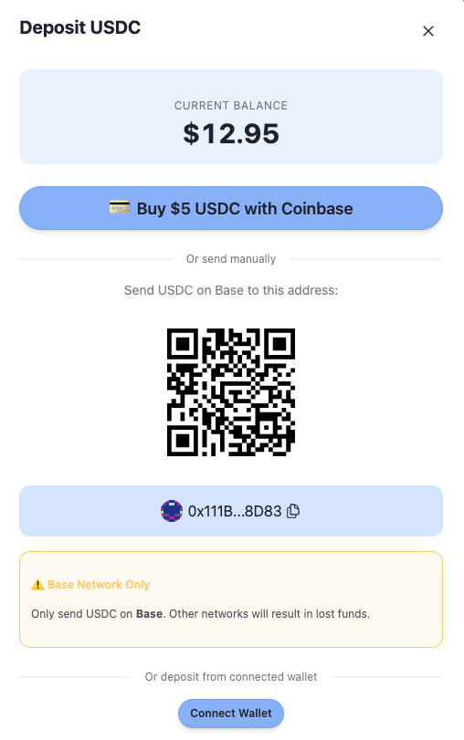
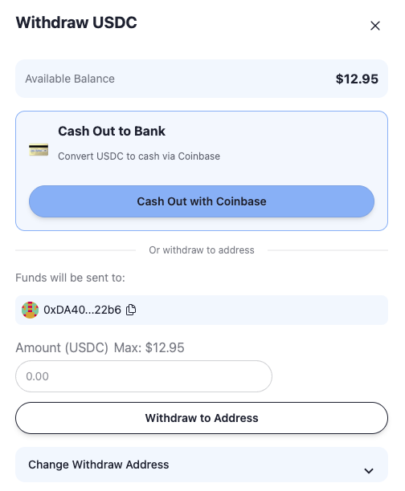

# Progressive Self-Custody

**Passkey-powered smart contract wallets for seamless crypto UX.**

Interact with smart contracts using just a face scan or fingerprint — no seed phrases, no gas management, no wallet extensions.



## What Is This?

A complete starter kit for building apps where users interact with crypto using only biometrics. Fork this repo, swap out `Example.sol` with your own contract logic, customize the UI, and ship.

**Perfect for:**
- DeFi apps that want mainstream users
- Games with on-chain assets
- Any app where "connect wallet" friction kills conversion

## How It Works

```
┌─────────────────────────────────────────────────────────────────┐
│  User taps [Create Account]                                     │
│  → Passkey generated (Face ID / fingerprint)                    │
│  → Smart wallet address computed (CREATE2)                      │
└─────────────────────────────────────────────────────────────────┘
                              ↓
┌─────────────────────────────────────────────────────────────────┐
│  User deposits USDC                                             │
│  → Buy with Coinbase Onramp (card/bank)                         │
│  → Or send from CEX / existing wallet                           │
│  → Facilitator deploys wallet on first deposit                  │
└─────────────────────────────────────────────────────────────────┘
                              ↓
┌─────────────────────────────────────────────────────────────────┐
│  User interacts with your app                                   │
│  → Taps button → Face scan → Done                               │
│  → Facilitator sponsors gas (no ETH needed)                     │
│  → Transaction executes on-chain                                │
└─────────────────────────────────────────────────────────────────┘
                              ↓
┌─────────────────────────────────────────────────────────────────┐
│  User withdraws anytime                                         │
│  → Cash out to bank via Coinbase Offramp                        │
│  → Or send to any address                                       │
└─────────────────────────────────────────────────────────────────┘
```

## Screenshots

### Deposit USDC
Buy crypto with a card via Coinbase, or send from an existing wallet.



### Withdraw USDC
Cash out to your bank account or send to any address.



## Key Features

### For Users
- **No seed phrases** — Passkeys are secured by device biometrics
- **No gas tokens** — Facilitator sponsors all transactions
- **No wallet apps** — Works in any browser with WebAuthn support
- **Easy onramp** — Buy USDC with card/bank via Coinbase
- **Easy offramp** — Cash out to bank via Coinbase

### For Developers
- **Fork and customize** — Swap `Example.sol` for your app logic
- **Gasless UX** — Users never touch ETH
- **Multi-device** — Users can add passkeys from multiple devices
- **Built on Scaffold-ETH 2** — All the dev tooling you know

## Architecture

| Component | Purpose |
|-----------|---------|
| **SmartWallet.sol** | User's smart contract wallet — holds assets, executes transactions via passkey signatures |
| **Factory.sol** | Deploys wallet clones via CREATE2 (deterministic addresses before deployment) |
| **Example.sol** | Sample contract showing how to receive USDC from passkey wallets |
| **Facilitator API** | Backend that relays signed transactions and pays gas |

## Tech Stack

- **Smart Contracts**: Solidity, Foundry
- **Frontend**: Next.js 14, TypeScript, Tailwind CSS
- **Wallet**: WebAuthn passkeys, EIP-1167 minimal proxies
- **Onramp/Offramp**: Coinbase Pay
- **Network**: Base (L2)

Built on [Scaffold-ETH 2](https://scaffoldeth.io).

## Quick Start

### Prerequisites
- Node.js >= v20
- Yarn
- Git

### Development

1. Clone and install:
```bash
git clone https://github.com/austintgriffith/progressive-self-custody.git
cd progressive-self-custody
yarn install
```

2. Start local blockchain:
```bash
yarn chain
```

3. Deploy contracts:
```bash
yarn deploy
```

4. Start frontend:
```bash
yarn start
```

Visit `http://localhost:3000`

### Environment Variables

Create `.env.local` in `packages/nextjs/`:

```env
# Facilitator wallet (pays gas for users)
FACILITATOR_PRIVATE_KEY=0x...

# Coinbase Developer Platform (for onramp/offramp)
COINBASE_API_KEY_NAME=...
COINBASE_API_KEY_SECRET=...
```

## Building Your App

1. **Fork this repo**

2. **Write your contract** — Replace `Example.sol` with your app logic
   ```solidity
   // packages/foundry/contracts/YourApp.sol
   function doSomething(address user, uint256 amount) external {
       // Users will call this via their passkey wallet
       IERC20(usdc).transferFrom(msg.sender, address(this), amount);
       // Your app logic here
   }
   ```

3. **Deploy** — Update the deploy script and run `yarn deploy`

4. **Build your UI** — Use SE-2 hooks to interact with your contract
   ```typescript
   const { writeContractAsync } = useScaffoldWriteContract({ 
     contractName: "YourApp" 
   });
   
   // User taps button → face scan → transaction
   await writeContractAsync({
     functionName: "doSomething",
     args: [userAddress, amount],
   });
   ```

5. **Customize the style** — Update colors, fonts, branding in `globals.css`

## Contributing

See [CONTRIBUTING.md](CONTRIBUTING.md)

## License

MIT
